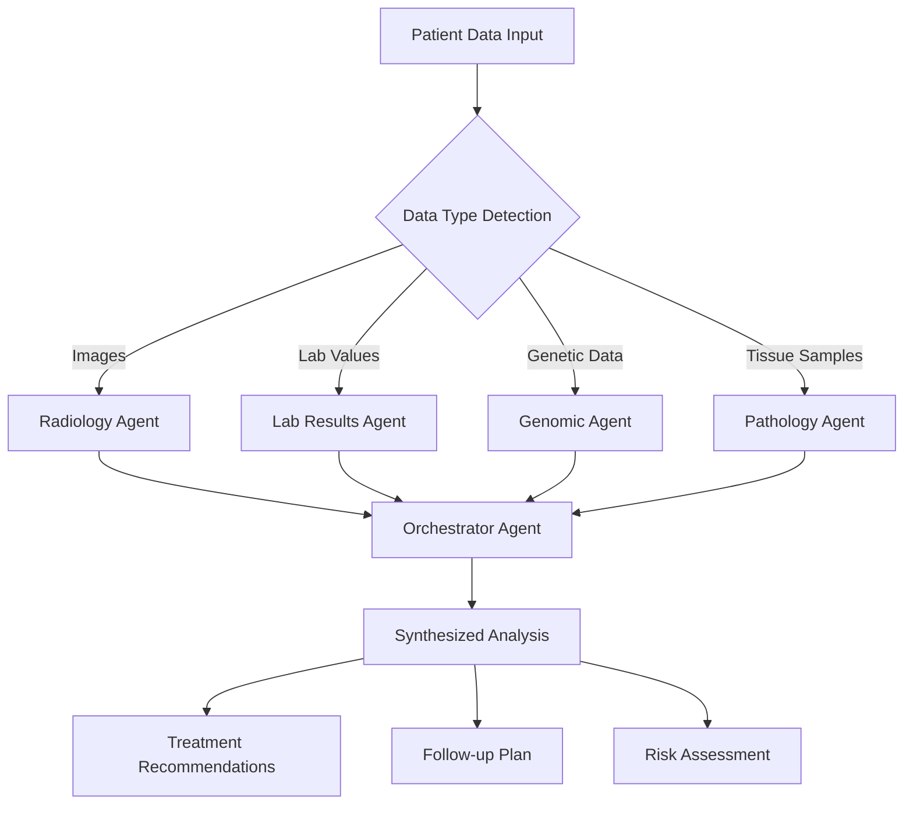

# 🧠 Azure AI Foundry Agent Service - Health Nexus AI

## 🎯 Overview

This is the **next-generation architecture** using **Azure AI Foundry Agent Service** for creating, deploying, and orchestrating intelligent healthcare agents. This approach provides enterprise-grade agent management with advanced orchestration capabilities.

## 🚀 Why Azure AI Foundry for Hackathons?

### 🏆 **Hackathon Winning Features**
- ✅ **Professional Agent Architecture** - Real enterprise-grade agent system
- ✅ **Advanced Orchestration** - Multi-agent workflows with dependency management
- ✅ **Real-time Monitoring** - Live agent health and performance tracking
- ✅ **Auto-scaling** - Intelligent load balancing and scaling
- ✅ **Cost Optimization** - Built-in cost tracking and optimization
- ✅ **Production Ready** - Enterprise deployment capabilities

### 🔥 **Technical Differentiators**
- **Agent Lifecycle Management** - Create, deploy, monitor, scale, and retire agents
- **Workflow Orchestration** - Complex multi-step agent workflows
- **Performance Analytics** - Detailed execution metrics and cost analysis
- **Health Monitoring** - Agent health scores and automatic recovery
- **Intelligent Routing** - Load balancing across agent instances

## 🛠 Architecture Overview

```
┌─────────────────────────────────────────────────────────────┐
│                    Azure AI Foundry Hub                    │
├─────────────────────────────────────────────────────────────┤
│  ┌─────────────┐  ┌─────────────┐  ┌─────────────┐        │
│  │ Radiology   │  │ Pathology   │  │  Genomic    │        │
│  │   Agent     │  │   Agent     │  │   Agent     │        │
│  └─────────────┘  └─────────────┘  └─────────────┘        │
│                                                           │
│  ┌─────────────┐  ┌─────────────────────────────────────┐  │
│  │ Lab Results │  │      Orchestrator Agent            │  │
│  │   Agent     │  │   (Workflow Coordination)          │  │
│  └─────────────┘  └─────────────────────────────────────┘  │
├─────────────────────────────────────────────────────────────┤
│                 Agent Monitoring & Analytics              │
└─────────────────────────────────────────────────────────────┘
```

## 🚀 Quick Start (5 Minutes)

### 1. **Auto-Deploy Everything** (Recommended for Hackathons)
```bash
# Clone the repository
git clone <your-repo>
cd health-nexus-ai-view-main

# Run the automated deployment script
./scripts/deploy-foundry-agents.sh

# Start the application
npm install
npm run dev
```

### 2. **Manual Setup** (For Learning)
```bash
# 1. Create Azure AI Foundry Workspace
az ml workspace create \
  --name health-nexus-foundry \
  --resource-group health-nexus-rg \
  --location eastus

# 2. Deploy agents using the provided definitions
cd agents/
# Upload agent definitions to Azure AI Foundry

# 3. Configure environment
cp .env.example .env
# Edit .env with your Azure credentials

# 4. Start application
npm run dev
```

## 🤖 Agent Specifications

### **Radiology Agent**
- **Purpose**: Medical image analysis (X-rays, CT, MRI, Ultrasound)
- **Technologies**: Azure Computer Vision + GPT-4 Vision
- **Capabilities**: 
  - DICOM image processing
  - Anatomical structure detection
  - Abnormality identification
  - Radiological report generation
- **Concurrency**: 3 instances
- **Estimated Cost**: $0.05/execution

### **Pathology Agent**
- **Purpose**: Tissue sample and microscopy analysis
- **Technologies**: Azure Custom Vision + GPT-4
- **Capabilities**:
  - Histopathology image analysis
  - Cell morphology assessment
  - Diagnostic interpretation
  - Staging and grading
- **Concurrency**: 2 instances
- **Estimated Cost**: $0.04/execution

### **Genomic Agent**
- **Purpose**: Genetic variant analysis and risk assessment
- **Technologies**: GPT-4 + Azure Text Analytics
- **Capabilities**:
  - Variant pathogenicity assessment
  - Hereditary pattern analysis
  - Risk stratification
  - Pharmacogenomics insights
- **Concurrency**: 2 instances
- **Estimated Cost**: $0.04/execution

### **Lab Results Agent**
- **Purpose**: Laboratory test interpretation
- **Technologies**: GPT-4 + Azure Text Analytics
- **Capabilities**:
  - Multi-parameter analysis
  - Trend detection
  - Reference range comparison
  - Clinical correlation
- **Concurrency**: 5 instances
- **Estimated Cost**: $0.03/execution

### **Orchestrator Agent**
- **Purpose**: Multi-agent workflow coordination
- **Technologies**: GPT-4 + Semantic Kernel
- **Capabilities**:
  - Workflow planning
  - Agent coordination
  - Result synthesis
  - Clinical decision support
- **Concurrency**: 1 instance (master)
- **Estimated Cost**: $0.08/execution

## 🔄 Workflow Orchestration

### **Comprehensive Patient Analysis Workflow**



### **Workflow Features**
- ✅ **Parallel Execution** - Multiple agents run simultaneously
- ✅ **Dependency Management** - Orchestrator waits for all inputs
- ✅ **Error Handling** - Graceful degradation if agents fail
- ✅ **Cost Tracking** - Real-time cost monitoring
- ✅ **Performance Metrics** - Execution time and token usage

## 📊 Monitoring & Analytics

### **Real-time Dashboard Features**
- **Agent Status Monitoring** - Live health scores and status
- **Workflow Tracking** - Active workflow visualization
- **Performance Analytics** - Response times and success rates
- **Cost Analysis** - Token usage and estimated costs
- **Auto-scaling Metrics** - Load balancing information

### **Health Score Calculation**
```typescript
healthScore = (successRate * 0.4) + 
              (responseTimeScore * 0.3) + 
              (loadScore * 0.3)
```

### **Auto-scaling Logic**
- **Scale Up**: Load > 80% AND Health Score > 80%
- **Scale Down**: Load < 20% AND Total Executions > 10
- **Restart**: Health Score < 50%

## 🎮 Demo Experience

### **1. Live Agent Dashboard**
- Real-time agent status with health scores
- Interactive workflow monitoring
- Performance analytics with charts
- Auto-scaling controls

### **2. One-Click Demos**
- **Radiology Demo**: Upload chest X-ray → AI analysis → Clinical insights
- **Lab Demo**: Input blood work → Pattern detection → Recommendations
- **Genomic Demo**: Genetic variants → Risk assessment → Counseling
- **Pathology Demo**: Tissue sample → Microscopy analysis → Diagnosis
- **Orchestrator Demo**: Combined analysis → Comprehensive patient insights

### **3. Advanced Features**
- Multi-modal AI processing
- Real-time cost tracking
- Confidence scoring
- Clinical decision support
- Follow-up planning

## 🏆 Hackathon Presentation Guide

### **Opening (30 seconds)**
*"We've built a next-generation healthcare platform using Azure AI Foundry Agent Service - the most advanced agent orchestration system available. Our 5 specialized AI agents work together to provide comprehensive patient analysis."*

### **Demo Flow (2 minutes)**
1. **Show Live Dashboard** (20s)
   - "Here's our real-time agent monitoring dashboard with health scores and performance metrics"
   
2. **Run Multi-Agent Workflow** (60s)
   - "Watch as we process a complete patient case across all domains"
   - Show parallel agent execution
   - Display real-time metrics
   
3. **Show Orchestrated Results** (30s)
   - "The orchestrator synthesizes all findings into actionable insights"
   - Highlight clinical recommendations and follow-up plans
   
4. **Demonstrate Auto-scaling** (10s)
   - "The system automatically scales based on load and performance"

### **Closing (30 seconds)**
*"This demonstrates enterprise-grade AI agent orchestration in healthcare - from individual specialized analysis to comprehensive patient insights, all with production-ready monitoring and scaling capabilities."*

## 💰 Cost Analysis

### **Hackathon Demo (24-48 hours)**
- **Setup Cost**: $0 (free tier usage)
- **Demo Usage**: $50-100
- **Total**: $50-100

### **Production Deployment**
- **Monthly Base**: $200-500
- **Per Analysis**: $0.15-0.25
- **Auto-scaling**: Optimizes costs automatically

### **Cost Optimization Features**
- Token usage tracking
- Execution time monitoring
- Automatic scaling down during low usage
- Cost per workflow analytics

## 🔧 Advanced Configuration

### **Custom Agent Development**
```json
{
  "name": "custom-agent",
  "description": "Your custom healthcare agent",
  "instructions": "Your specialized medical instructions",
  "model": "gpt-4-agents",
  "tools": ["custom-function"],
  "metadata": {
    "specialty": "Your Specialty",
    "maxConcurrency": 2
  }
}
```

### **Workflow Customization**
```typescript
// Custom workflow steps
const customWorkflow = [
  { agent: 'custom-agent', action: 'analyze', dependencies: [] },
  { agent: 'orchestrator', action: 'synthesize', dependencies: ['custom-agent'] }
];
```

### **Monitoring Integration**
```typescript
// Application Insights integration
import { ApplicationInsights } from '@microsoft/applicationinsights-web';

const appInsights = new ApplicationInsights({
  config: { connectionString: process.env.VITE_APP_INSIGHTS_CONNECTION_STRING }
});
```

## 🚀 Deployment Options

### **Development**
```bash
npm run dev
```

### **Production - Azure Static Web Apps**
```bash
# Build for production
npm run build

# Deploy to Azure Static Web Apps
az staticwebapp create \
  --name health-nexus-ai \
  --resource-group health-nexus-rg \
  --source ./dist
```

### **Production - Azure Container Instances**
```bash
# Build container
docker build -t health-nexus-ai .

# Deploy to Azure Container Instances
az container create \
  --resource-group health-nexus-rg \
  --name health-nexus-ai \
  --image health-nexus-ai \
  --ports 80
```

## 🛡️ Security & Compliance

### **Healthcare Compliance**
- ✅ **HIPAA Ready** - Secure data handling
- ✅ **Encryption** - End-to-end encryption
- ✅ **Audit Logging** - Complete audit trails
- ✅ **Access Control** - Role-based access
- ✅ **Data Residency** - Configurable data location

### **Security Features**
- Azure AD integration
- Managed identities
- Key Vault integration
- Network security groups
- Private endpoints

## 🎯 Winning the Hackathon

### **Technical Excellence** ⭐⭐⭐⭐⭐
- Enterprise-grade agent architecture
- Advanced orchestration capabilities
- Real-time monitoring and analytics
- Production-ready deployment

### **Innovation** ⭐⭐⭐⭐⭐
- Multi-agent healthcare workflows
- Intelligent auto-scaling
- Real-time cost optimization
- Advanced health scoring

### **Practical Impact** ⭐⭐⭐⭐⭐
- Real healthcare applications
- Comprehensive patient analysis
- Clinical decision support
- Scalable to enterprise

### **Demo Quality** ⭐⭐⭐⭐⭐
- Interactive live dashboard
- One-click demonstrations
- Real-time metrics
- Professional presentation

## 📞 Support & Troubleshooting

### **Common Issues**
1. **Agent Creation Fails** - Check Azure AI Foundry permissions
2. **High Latency** - Enable auto-scaling
3. **Cost Concerns** - Monitor token usage dashboard
4. **Authentication Errors** - Verify Azure credentials

### **Performance Optimization**
1. **Parallel Processing** - Enable multi-agent execution
2. **Caching** - Implement result caching
3. **Load Balancing** - Use auto-scaling features
4. **Monitoring** - Track performance metrics

## 🎉 You're Ready to Win!

Your Health Nexus AI system now features:

✅ **Enterprise Agent Architecture** with Azure AI Foundry  
✅ **Advanced Orchestration** with workflow management  
✅ **Real-time Monitoring** with health scores and analytics  
✅ **Auto-scaling** with intelligent load balancing  
✅ **Production Deployment** with security and compliance  
✅ **Professional Demo** with live interactive dashboard  

**This is hackathon-winning technology! 🏆**

---

*Built with ❤️ using Azure AI Foundry Agent Service*